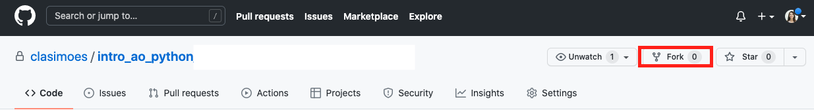
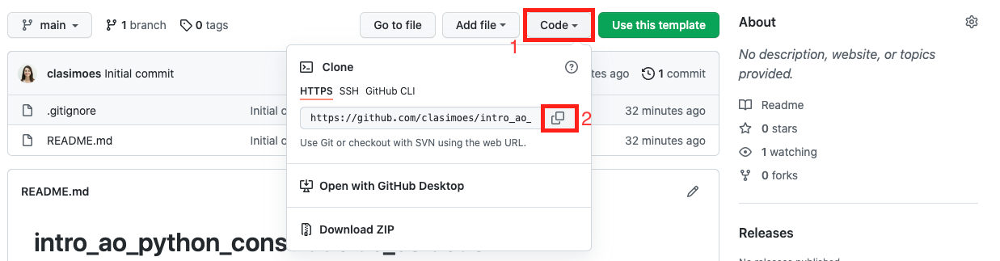

# WoMakersCode - Bootcamp Python Backend para Iniciantes

## Visão Geral
Bem vinda ao repositório do curso Bootcamp Python Backend para Iniciantes.
Aqui vamos manter os exemplos utilizados durante as aulas.
Você poderá rodar os exemplos em sua própria máquina após ter seguido a configuração de ambiente proposta em aula.
Além disso, ao realizar um `fork` do nosso repositório para a sua própria conta no GitHub, você poderá publicar suas soluções para os exercícios propostos.

## Como utilizar este repositório
Você deverá realizar um _fork_ desse repositório para sua conta no GitHub e utilizar sua própria versão do repositório para trabalhar.

O próximo passo é clonar o seu repositório em seu computador.
Após criar sua própria versão "forkada" do repositório original, vá até sua página de github e abra seu novo repositório.
Clique no botão "Code" e em seguida, no botão para copiar o endereço do seu repositório.

Para começar, abra uma ferramenta de terminal (PowerShell se você estiver utilizando Windows ou Terminal se estiver utilizando Linux ou Mac). Escolha uma pasta para onde seu repositório será clonado e utilize o comando `git` para clonar o repositório em seu computador.

``` bash
cd ~\workspace
git clone <endereço que você copiou>
```

Você poderá utilizar seu repositório de duas maneiras:

1. Rodar os códigos de exemplo realizados durante as aulas.
2. Resolver os desafios propostos e postar sua solução no seu GitHub pessoal.

Ao clonar o repositório, realize o primeiro `commit` incluindo seu nome neste arquivo README.

Bons estudos e divirta-se!
